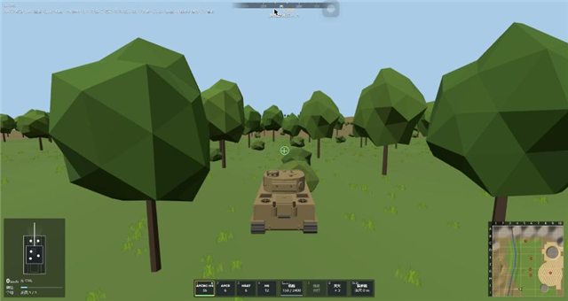
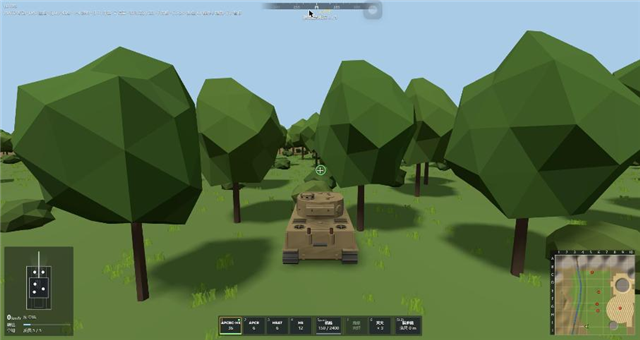
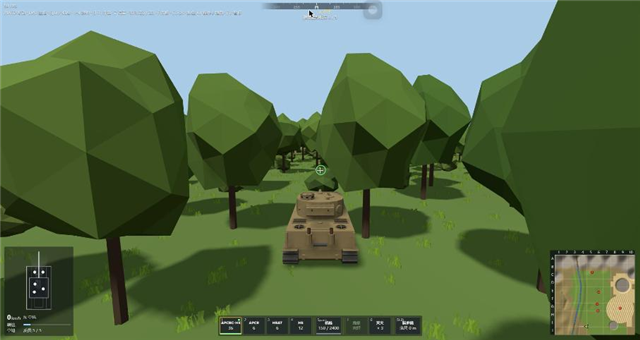

# 本机帧率基线(2026-09-30)

任务卡:[001](../tasks/001-perf-baseline.md)。测试:Claude Code,通过 Claude in Chrome 操作负责人本机的 Chrome。

## 环境

- 显卡:**Intel UHD Graphics**(核显,设备 ID 0xA7A8),ANGLE / Direct3D 11。`WEBGL_debug_renderer_info` 读出的 GL_RENDERER:`ANGLE (Intel, Intel(R) UHD Graphics (0x0000A7A8) Direct3D11 vs_5_0 ps_5_0, D3D11)`
- 浏览器:**Chrome 156**(Windows 11 x64);12 个逻辑核心,16 GB 内存
- 窗口:1920 × 1021(CSS 像素),devicePixelRatio 1;显示器 60 Hz,帧率上限 60
- 代码:main 1576f3c(第五轮代码 df2f26b + 文档),`npm run dev`
- 载具:虎式 E(默认);地图:河谷试验场

## 方法

- **帧率**:在页面里用 requestAnimationFrame 记录每一帧的间隔,算平均帧率。「每秒最低」是按 1 秒切窗口,取最低的那个窗口。设置里的「显示帧率」也打开了(截图左上角),但那是滑动平均,只作参考。
- **操作**:Chrome 扩展拿不到鼠标锁定(窗口不在前台),所以在页面里伪造了锁定状态,用脚本发键盘事件开车、开镜。没有改任何源码。
- **每档画质**:改设置 → 刷新页面 → 进入战斗 → 等 8 秒(着色器编译、植被生成)→ 开始测。
  - A:出生点 (0, 1200) 朝北,静止 10 秒;
  - B:原地左转朝西,用 `__debug.advance` 快进到树林东缘(x = −130),然后实时边开边测 15 秒,开进林子里(x ≈ −280);
  - C:Shift 开镜、Z 切到 5×,朝北,静止 10 秒。
- 另外记录了每帧 draw call 数(包装 WebGL 的 draw 调用,数 30 帧取平均)和一步物理 + AI 的耗时(`__debug.advance(1)` 的 60 步取平均)。

## 结果(机器空闲时)

| 画质 | A 静止 | B 树林行驶:平均 / 每秒最低 | C 开镜 5× |
|---|---|---|---|
| 低(阴影关、渲染 75%、视距 2500 m、植被 40%、草 60 m) | 59.9 | 59.9 / 59 | 60.0 |
| 中(阴影低、渲染 100%、视距 4000 m、植被 70%、草 100 m) | 57.9 | 55.4 / 52 | 59.9 |
| 高(阴影高、渲染 100%、视距 6000 m、植被 100%、草 150 m) | 51.3 | 44.8 / 42 | 57.7 |

高画质测了两次,另一次 A 51.0、B 46.6 / 44,和上表一致。

| 画质 | draw call / 帧(A / B / C) | 物理 + AI 一步 |
|---|---|---|
| 低 | 约 210 / 86 / 70–100 | 0.5–1.2 ms |
| 中 | 190–255 / 118 / 116 | 0.8–1.5 ms |
| 高 | 270 / 135 / 110–125 | 0.5–0.8 ms |

## 后台有负载时

第一轮测量时,另一个 agent 正在同一台机器上跑 `tsc` 和 Vitest。三档的平均帧率都掉到 11–33,每秒最低掉到 6–10。第二轮低、中两档也测出过 28–33 的低值,原因没有查清(可能是桌面应用自己也在用核显绘制界面)。以上都不计入结果表。

核显和 CPU 共用功耗和内存带宽,CPU 满载时核显会降频,这不是游戏本身的问题。

## 结论

1. **机器空闲时三档都流畅**:低、中基本顶到 60 帧;高画质在树林里最低,约 45 帧,每秒最低 42。没有发现明显卡顿。
2. **瓶颈在核显的渲染,不在 CPU**:draw call 只有 70–270,物理 + AI 一步 0.5–1.5 ms,都远低于 16.7 ms 的帧预算。
3. **植被和画质预设暂时不需要优化**:三档帧率从高到低单调上升,档位差距合理;中画质已经接近 60。高画质比中画质多了 2048 阴影贴图、100% 植被和 150 m 草丛,这次没有分开测是哪一项在拖慢。以后如果要让高画质在树林里也稳定 60 帧,先把这三项分开测。
4. 同时跑编译 / 测试时帧率会减半。实机试玩判断手感时,先关掉后台任务。

## 顺带发现的问题(不在本卡范围)

- **「重新开始本局」绑键后会每帧都重开**:`src/main.ts` 的战斗循环里,按下重开键后调用 `startBattle()` 直接 `return`,跳过了帧末的 `input.endFrame()`,「本帧按下」的状态一直留着,下一帧又重开。表现是帧率掉到 3 左右、物理停住、画面卡住或黑屏(实测 2 秒内新建了 7 局)。默认没有绑这个键,Esc 菜单里的「重新开始」不受影响。修法是在 `return` 前补上 `input.endFrame()`,建议开卡修复并加回归测试。

## 截图(场景 B)

低:

中:

高(能看到树影):

