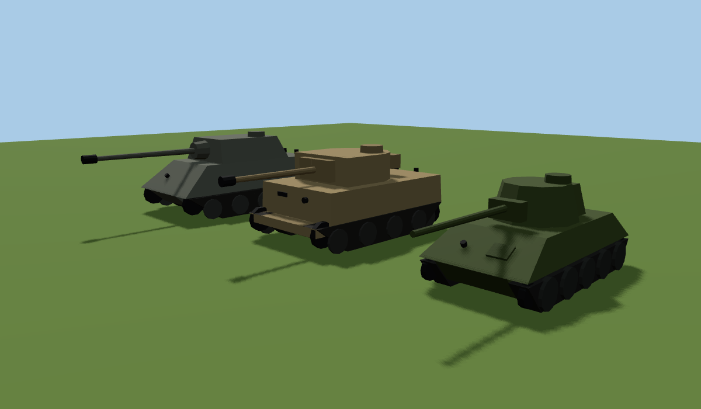
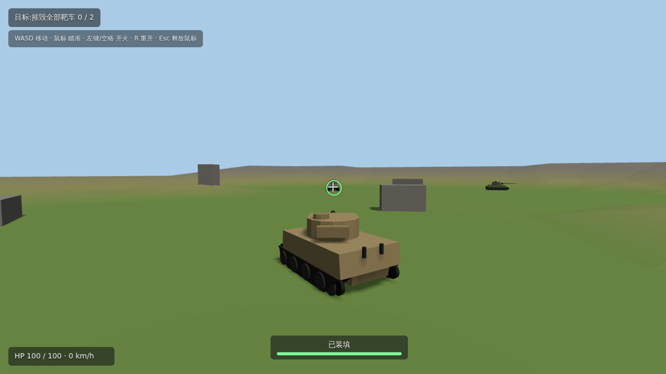
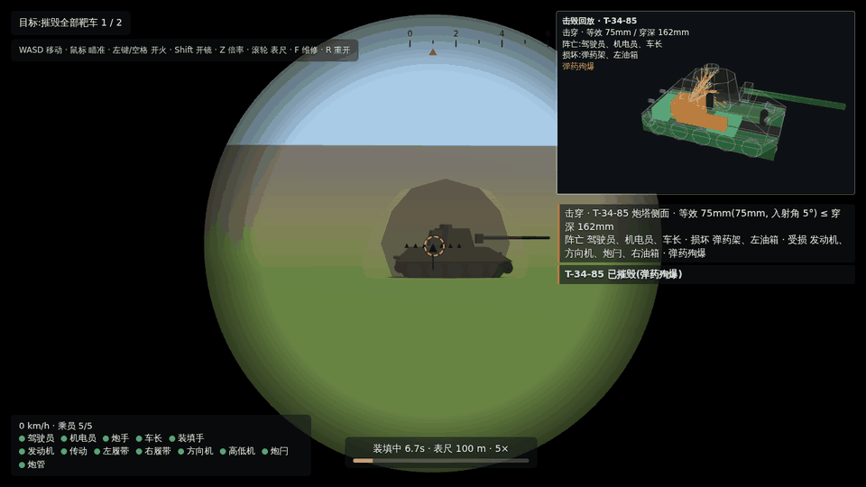
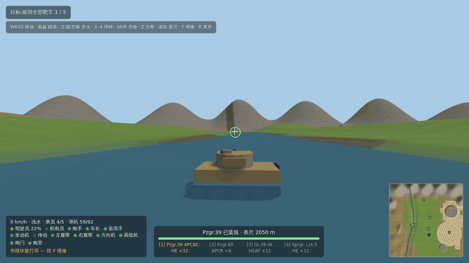

# 物理校验报告:虎式原型车 + 两辆靶车

> 2026-09-25 · 对应测试:`tests/realism.test.ts`(23 项,全部通过)· 数据:`src/data/vehicles.ts`
>
> 目标:在「小范围误差可以接受,但不能太离谱」的前提下,核对开火、机动、穿深三块逻辑是否符合真实世界的物理规律和公开资料。

## 结论

- **穿深 vs 距离**:虎式 88 L/56 在 100–2000 m 与实测表误差 ≤ 1.3%;虎王 88 L/71 ≤ 4.4%;T-34-85 的 85 炮 ≤ 7.1%。
- **弹道**:60Hz 游戏积分与 1 ms 高精度积分的飞行时间、下坠误差 < 1%;有空气阻力,1000 m 存速 692 m/s。
- **机动**:极速达到数据值的 99%+;加速曲线满足 P = F·v 功率约束(超出不到 3.5%);由极速反推的有效功率是发动机功率的 63%–77%,落在履带车辆合理的传动效率范围内;虎式理论爬坡极限约 34°,实测 33° 能爬、35° 以上爬不动、40° 溜坡。
- **需要你知道的偏差**:30° 倾角板在中远距离偏乐观约 20%(第 4 节第 1 条);85 炮远距离穿深偏高(第 4 节第 2 条);单套装甲导致部分弱点 / 强点没有建模(第 4 节第 3 条)。都不算离谱,但会影响平衡,详见第 4 节。

## 1. 选车与建模

| 角色 | 载具 | 为什么选它 |
|---|---|---|
| 原型车(玩家) | **虎式 Ausf. E** | 箱形车体、装甲近乎垂直。本项目碰撞体是「车体盒 + 炮塔盒」,虎式是和这个模型最贴合的真实坦克,误差最小;公开资料也最齐全 |
| 移动靶 | **T-34-85(1944)** | 大倾角装甲的代表,用来检验「倾斜装甲换算成视线厚度」的做法;10 km/h 匀速往返 |
| 静止靶 | **虎王(亨舍尔炮塔)** | 正面 180mm+,虎式 88 L/56 在任何距离都打不穿,用来检验「正面打不穿、要绕侧面」 |

模型:三辆车都是程序化低多边形模型(`src/game/models/`),尺寸按资料:虎式有交错负重轮、马蹄形炮塔和双室制退器;T-34-85 有 60° 首上、克里斯蒂大负重轮和铸造炮塔;虎王有 50° 首上和楔形炮塔。碰撞体仍然是按 `hull` / `turret` 尺寸生成的两个盒子,模型和碰撞盒基本重合(T-34 圆炮塔的四角有少量「空气装甲」)。

**装甲的填法**:碰撞盒的面是竖直的,所以 `armor` 填的是「水平来弹的视线厚度」= 厚度 / cos(倾角)。对水平射击(坦克对坦克的常见情况)这个换算是**精确的**:倾角 s 的板被水平偏角 h 的炮弹命中时,真实等效厚度 = t / (cos s · cos h),正好等于「视线厚度 / cos h」,也就是本项目的算法。

## 2. 本轮对物理模型的改动

全部是局部实现,没有改核心数据结构;每一项都可以单独退回。

| 项目 | 之前 | 现在 | 为什么 |
|---|---|---|---|
| 加速 | 恒定 4 m/s²(虎式 3 秒到 45 km/h) | 牵引 = min(起步上限, P/v) − 滚动阻力;P/m 由「极速时牵引力 = 滚动阻力」反推 | 原来的加速对 57 吨的车太离谱;现在只用已有的 `maxSpeed` 和 `acceleration` 两个字段,就能得到符合 P = F·v 的曲线和爬坡能力 |
| 倒车 | 极速的 50%(虎式 22.7 km/h) | 20%(8–11 km/h) | 二战坦克倒车一般 5–10 km/h |
| 刹车 | 10 m/s²(≈1 g) | max(5, 起步牵引) ≈ 0.5–0.6 g | 1 g 超过了履带附着力 |
| 侧向抓地 | 15 m/s² | 8 m/s²(≈0.8 g) | 同上 |
| 质量 | 车体密度 1100、炮塔 300 | 两个盒子统一 1110 kg/m³ | 虎式 57.1 t(真实 57 t) |
| 空气阻力 | 无 | dv/dt = −k·|v|·v,k = 1.2×10⁻⁴ /m(`DRAG_K`) | 由虎式 88 的穿深–距离表拟合,二战全口径穿甲弹大致在 1.0–2.2×10⁻⁴ |
| 穿深衰减 | 穿深不随距离变化 | 穿深 ∝ v^1.43(de Marre),`shell.penetration` 改为「炮口穿深」 | 与上一项一起,让远距离穿深下降;`DRAG_K = 0` 即退回原来的行为 |
| 弹道积分 | 半隐式欧拉 | 位移用步首、步末速度的平均(梯形) | 1000 m 下坠误差从 1.2% 降到 < 0.1% |

## 3. 校验结果

### 3.1 穿深随距离衰减(垂直板,50% 击穿判据)

| 距离 | 虎式 KwK 36 实测 | 模拟 | 误差 | 虎王 KwK 43 实测 | 模拟 | 误差 | T-34-85 实测 | 模拟 | 误差 |
|---|---|---|---|---|---|---|---|---|---|
| 100 m | 162 | 162.2 | +0.1% | 233 | 233.0 | 0.0% | — | 133.7 | — |
| 500 m | 151 | 151.4 | +0.3% | 219 | 217.5 | −0.7% | 125 | 124.8 | −0.1% |
| 1000 m | 138 | 139.0 | +0.7% | 204 | 199.6 | −2.1% | 107 | 114.6 | +7.1% |
| 1500 m | 126 | 127.6 | +1.3% | 190 | 183.3 | −3.6% | — | — | — |
| 2000 m | 116 | 117.2 | +1.0% | 176 | 168.2 | −4.4% | — | 96.6 | — |

测试容差:KwK 36 ±3%、KwK 43 ±5%、85 炮 ±8%。

### 3.2 30° 倾角板

本项目规则:能击穿的 30° 板厚 = 穿深 × cos30°。

| 距离 | KwK 36 实测 | 模拟 | 误差 | KwK 43 实测 | 模拟 | 误差 |
|---|---|---|---|---|---|---|
| 100 m | 132 | 140.5 | +6.4% | 202 | 201.8 | −0.1% |
| 500 m | 110 | 131.2 | +19.2% | 185 | 188.4 | +1.8% |
| 1000 m | 99 | 120.4 | +21.6% | 165 | 172.9 | +4.8% |
| 2000 m | 83 | 101.5 | +22.3% | 132 | 145.7 | +10.4% |

近距离吻合;KwK 36 在中远距离偏乐观约 20%(见第 4 节第 1 条)。测试只卡 100 m 处 ±10%。

### 3.3 弹道(虎式 KwK 36 · Pzgr.39,炮口初速 780 m/s)

| 距离 | 飞行时间 | 存速 | 下坠 |
|---|---|---|---|
| 100 m | 0.129 s | 771 m/s | 0.08 m |
| 500 m | 0.661 s | 735 m/s | 2.10 m |
| 1000 m | 1.362 s | 692 m/s | 8.75 m |
| 2000 m | 2.898 s | 614 m/s | 38.1 m |

- 与同一方程的 1 ms 步长积分相比,飞行时间、下坠误差 < 1%(测试断言)。
- 有空气阻力时飞行时间和下坠都大于真空值(1000 m 真空:1.282 s / 8.06 m),符合预期。
- 训练场只有 200 m 见方,场内下坠 < 0.35 m,瞄准点没有做下坠补偿。

### 3.4 历史对局常识(全部通过)

| 情形 | 资料 | 模拟 |
|---|---|---|
| 虎式 → T-34-85 正面,30° 侧角 | 100–1400 m 可击穿(德方估算) | 1400 m:穿深 130 > 等效 104,击穿 |
| T-34-85 → 虎式正面 100mm | 500 m 可击穿炮塔正面 | 500 m:125 > 100,击穿 |
| 虎式 → 虎王正面 | 打不穿 | 10 m:165 < 180,未击穿 |
| 虎王 → 虎式正面 | 远距离可击穿 | 2000 m:168 > 100,击穿 |

### 3.5 机动(平地、硬地面)

| | 虎式 | T-34-85 | 虎王 |
|---|---|---|---|
| 极速:资料 / 模拟 | 45.4 / 45.2 km/h | 53 / 52.6 km/h | 41.5 / 41.4 km/h |
| 0→20 km/h | 3.7 s | 3.0 s | 4.2 s |
| 0→30 km/h | 10.9 s | 8.2 s | 13.3 s |
| 0→40 km/h | 32.1 s | 19.6 s | 55.4 s(已接近极速) |
| 反推有效功率 / 发动机功率 | 353 / 515 kW(68%) | 234 / 370 kW(63%) | 395 / 510 kW(77%) |
| 倒车极速 | 9.1 km/h | 10.6 km/h | 8.3 km/h |
| 满速刹停 | 12.9 m / 2.1 s | 18.9 m / 2.6 s | 11.8 m / 2.1 s |
| 碰撞体质量 / 战斗全重 | 57.1 / 57 t(+0.2%) | 39.5 / 32.4 t(+22%) | 74.5 / 69.8 t(+7%) |

- 加速时间与 1 ms 步长独立积分一致(误差 < 0.2%),每一步用掉的功率不超过有效功率的 103.5%。
- 二战坦克没有可靠的加速实测数据,所以这里不和「资料值」比加速时间,而是检验它满足功率约束、并用效率区间反查发动机功率是否对得上。

### 3.6 爬坡(虎式,满油门 15 s)

| 坡度 | 20° | 25° | 30° | 33° | 34° | 35°–37° | 40° |
|---|---|---|---|---|---|---|---|
| 结果 | 5.8 km/h 上坡 | 4.8 km/h | 4.1 km/h | 3.8 km/h | 1.3 km/h 蠕行 | 停住 | 向下溜 |

理论极限 asin((6.0 − 0.49) / 9.81) ≈ 34.2°;二战坦克常见标称爬坡角 30°–35°(常见值,没有找到虎式的一手出处)。

### 3.7 炮塔

虎式旋转 180° 用时 9.47 s,与 19°/s 一致(液压旋转、发动机 2000 rpm 高速档;低速档只有 6°/s,阶段 0 不模拟转速对旋转速度的影响)。

## 4. 已知偏差

1. **30° 倾角板中远距离偏乐观约 20%(KwK 36)。** 本项目按几何视线厚度(t / cos θ)判定;德方 30° 表在 500 m 以后比几何换算低很多,KwK 43 却与几何换算吻合,可能和不同表格的判据有关。影响:中远距离斜着打时,虎式略强于史实。改进办法是在判定里加一个随入射角增强的指数(例如 t / cos^n θ),这会改动你已确认的穿透规则,所以没动。
2. ~~**85 炮远距离穿深偏高(1000 m +7%)。**~~ 第四轮改为逐发计算阻力(BR-365 按穿深表拟合 Cd = 0.55),误差降到 3% 以内,见第 8.2 节。
3. **每个部件只有一套装甲**(`ArmorSpec` 为 front / side / rear):虎王首下 156mm 的弱点、虎式侧面下部 60mm 都没有建模,取的是覆盖面积最大的那块板。(第三轮已加 `turretArmor`,T-34-85 炮塔侧面 75mm 等炮塔装甲已单独建模。)
4. **T-34-85 质量偏重 22%**:它的车体大幅倾斜,盒子体积偏大,只影响碰撞推挤。
5. **估算值**:三辆车的车体转向速度、T-34-85 的炮塔转速没有找到可靠一手数据,是按同类坦克估的。
6. **地面类型没有建模**:滚动阻力统一按硬地面 0.05 取值,所以越野也能跑到路面极速(虎式越野实测约 20–25 km/h)。
7. **后坐力、炮弹对目标的冲量没有模拟**(牛顿第三定律),游戏里开炮不会让车身晃动。
8. **虎式极速**:第一、二轮取额定值 45.4 km/h(3000 rpm);第三轮按确认改为 1944 后期型的 38 km/h(1943 年 11 月后限速 2500 rpm),英军 1945 年实测 34.6 km/h。第 3.5 节表格仍是 45.4 km/h 时的数据,新数值见第 7.1 节。

## 5. 需要你确认的事项

- ~~是否放宽「不做真实弹道学」这条非目标~~:已由负责人改为「简化真实弹道学」(Readme.md 声明)。
- **[待确认] 三个能进一步减小偏差的数据结构扩展**(都会改核心数据结构,所以没做):
  - `VehicleSpec.turretArmor`(炮塔单独一套装甲)→ 解决第 3 条;
  - `ShellSpec` 加阻力系数(或弹重 + 口径)→ 解决第 2 条;
  - `HullSpec.mass`(直接填战斗全重)→ 解决第 4 条。
- ~~上一轮补充的 `hull / turret / color` 字段~~:已写入 Readme.md 的数据结构约定。

## 6. 资料出处

- [Tiger I — Wikipedia](https://en.wikipedia.org/wiki/Tiger_I):尺寸、质量、装甲、发动机 515 kW、极速 45.4 km/h、炮塔旋转 6 / 19 / 36°/s、各方穿深评估
- [8.8 cm KwK 36 — Wikipedia](https://en.wikipedia.org/wiki/8.8_cm_KwK_36):Pzgr.39 初速 780 m/s、0° / 30° 穿深表
- [Tiger II — Wikipedia](https://en.wikipedia.org/wiki/Tiger_II):尺寸、69.8 t、各面装甲与倾角、极速 41.5 km/h
- [8.8 cm KwK 43 — Wikipedia](https://en.wikipedia.org/wiki/8.8_cm_KwK_43):Pzgr.39/43 初速 1000 m/s、0° / 30° 穿深表、射速
- [T-34-85 — Wikipedia](https://en.wikipedia.org/wiki/T-34-85):32.4 t、370 kW、53 km/h
- [T-34 — Wikipedia](https://en.wikipedia.org/wiki/T-34):装甲倾角、变速箱、85 炮对虎式的击穿距离
- [T-34-85 — Tank Encyclopedia](https://tanks-encyclopedia.com/ww2/soviet/soviet_t34-85):尺寸、各面装甲
- [85 mm air defense gun M1939 (52-K) — Wikipedia](https://en.wikipedia.org/wiki/85_mm_air_defense_gun_M1939_(52-K)):85mm 穿甲弹 792 m/s,500 m / 1000 m 穿深
- [Tiger I (Tank Encyclopedia)](https://tanks-encyclopedia.com/ww2/germany/panzer-vi_tiger.php):俯仰 −7° / +16°、射速 5–8 发/分、英军实测 34.6 km/h
- [Tiger I Information Center — Transmission](https://www.alanhamby.com/transmission.shtml)、[Panzerbasics — Driving Tiger E](https://www.panzerbasics.com/panzer/01_basics/01_Tiger_E/driving.htm):8 前 4 倒挡、中心转向、限速改动

## 7. 第三轮更新(2026-09-25:1944 后期型虎式、瞄准镜、模块化伤害)

### 7.1 虎式改为 38 km/h 后的机动

| | 数值 |
|---|---|
| 极速:资料 / 模拟 | 38 / 37.9 km/h |
| 0→20 / 30 / 35 km/h | 4.8 s / 16.6 s / 34.9 s |
| 反推有效功率 / 发动机功率 | 按 515 kW 算约 57%(在 55%–95% 区间内但偏低)。限速后的 HL 230 在 2500 rpm 实际只有约 440 kW,按它算约 67% |

### 7.2 表尺射表(游戏内弹道积分算出,「表尺设为 X m」时火炮相对瞄准线的抬高角)

| | 500 m | 1000 m | 1500 m | 2000 m |
|---|---|---|---|---|
| 虎式 KwK 36(780 m/s) | 4.2 mrad(14′) | 8.8 mrad(30′) | 13.7 mrad(47′) | 19.1 mrad(66′) |
| T-34-85 ZiS-S-53(792 m/s) | 4.1 mrad | 8.5 mrad | 13.3 mrad | 18.5 mrad |
| 虎王 KwK 43(1000 m/s) | 2.6 mrad | 5.3 mrad | 8.3 mrad | 11.6 mrad |

- 用 1 ms 步长的独立积分检验:按表抬高后,炮弹在 200–2500 m 各距离回到瞄准线的误差 < 0.15 m。
- 整车集成测试:1000 m 外瞄炮塔中心,表尺设 1000 m 命中炮塔;表尺 0 m 落在目标前方地面;表尺错 200 m(设 800 m)打不中炮塔。
- 没找到 KwK 36 的原始射表来逐点对照;弹道本身(飞行时间、下坠)已在 3.3 节与高精度积分对齐,误差 < 1%。

### 7.3 模块受损后的性能(虎式,平地满油门 60 s)

| 发动机血量 | 100% | 60% | 30% |
|---|---|---|---|
| 极速 | 37.1 km/h | 22.7 km/h | 11.4 km/h |

与「性能 = 血量比例」一致。

### 7.4 实机画面

右上角回放:半透明车体 + 内部模块 / 乘员(绿 = 完好,黄 = 血量 50% 以上,橙 = 50% 以下,黑 = 打坏 / 阵亡);红线是弹体,黄线是崩落破片,橙线是弹片,橙色球是 APHE 装药爆炸范围。

## 8. 第四轮更新(2026-09-26:多弹种、弹药架、地表、还击 AI)

### 8.1 弹种数据(公开资料)

| 车 | 弹 | 弹种 | 弹重 kg | 初速 m/s | 装药 g | 穿深(0°)依据 |
|---|---|---|---|---|---|---|
| 虎式 KwK 36 | Pzgr.39 | APCBC-HE | 10.2 | 773 | 59 | 162mm@100m(美方计算值) |
| | Pzgr.40 | APCR | 7.3 | 930 | — | 219mm@100m(同上) |
| | Gr.39 HL | HEAT | 7.65 | 600 | 680 | 110mm,与距离无关 |
| | Sprgr. L/4.5 | HE | 9.0 | 820 | 860 | 按装药查表 ≈ 12mm |
| T-34-85 ZiS-S-53 | BR-365 | APHEBC(钝头 + 风帽) | 9.2 | 792 | 164 | 125mm@500m、107mm@1000m |
| | BR-365K | APHE(尖头无帽) | 9.2 | 792 | 48 | 142mm@100m |
| | BR-365P | APCR(线轴式) | 4.99 | 1050 | — | 175mm@100m |
| | O-365K | HE | 9.54 | 785 | 741 | 按装药查表 ≈ 11mm |
| 虎王 KwK 43 | Pzgr.39/43 | APCBC-HE | 10.4 | 1000 | 59 | 232mm@100m |
| | Pzgr.40/43 | APCR | 7.3 | 1130 | — | 304mm@100m |
| | Gr.39/3 HL | HEAT | 7.65 | 600 | 680 | 110mm |
| | Sprgr.43 | HE | 9.4 | 750(估算) | 1000 | 按装药查表 ≈ 13mm |

说明:

- BR-365 与 BR-365K 的装药量常被混淆。164 g 是钝头 BR-365 的,48 g A-IX-2 是尖头 BR-365K 的。
- Sprgr.43 的初速没找到可靠出处,按 750 m/s 估算。
- 碎甲弹(HESH)战后才装备坦克,这三辆车都没有配发过。代码里有它的规则和测试,但没有配给任何一辆车。

### 8.2 阻力系数与穿深 – 距离曲线(模型 / 参考值,mm,100 / 500 / 1000 / 1500 / 2000 m)

阻力参数 k = ρ/2 · Cd · A / m,A 为弹径截面积。

| 弹 | Cd | 模型 | 参考值 | 最大误差 |
|---|---|---|---|---|
| Pzgr.39 | 0.34(弹种默认) | 162 / 151 / 139 / 127 / 117 | 162 / 151 / 138 / 126 / 116 | 0.9% |
| Pzgr.40 | 0.30(弹种默认) | 219 / 201 / 181 / 162 / 146 | 219 / 200 / 179 / 160 / 143 | 2.1% |
| BR-365 | 0.55(拟合) | 140 / 125 / 108 / 93 / 81 | 139 / 123 / 105 / 91 / 81 | 2.9% |
| BR-365K | 0.55(拟合) | 142 / 126 / 109 / 95 / 82 | 142 / 125 / 107 / 92 / 78 | 5.1% |
| BR-365P | 0.60(拟合) | 175 / 138 / 103 / 77 / 58 | 175 / 136 / 100 / 73 / 54 | 7.4% |
| Pzgr.39/43 | 0.34(弹种默认) | 232 / 217 / 199 / 183 / 168 | 232 / 219 / 204 / 190 / 176 | 4.5% |
| Pzgr.40/43 | 0.27(拟合) | 304 / 281 / 256 / 232 / 211 | 304 / 282 / 257 / 234 / 213 | 0.9% |

- 德制全口径弹的 Cd ≈ 0.34 是合理的超音速阻力系数。苏制弹掉速明显更快,按表拟合出 0.55–0.6。
- 这样同时消除了第 4 节第 2 条「85 炮远距离穿深偏高」的偏差。
- `tests/realism.test.ts` 对这七条曲线逐点设了容差(3%–8%)。

### 8.3 各弹种的入射角与跳弹规则

| 弹种 | 等效装甲 | 跳弹角(0% / 50% / 100%) | 击穿后 |
|---|---|---|---|
| AP / APHE(尖头无帽) | t / cos θ | 47° / 60° / 65° | 弹体 + 崩落破片;APHE 延时起爆 |
| APC / APCBC / APCBC-HE | t / cos θ | 48° / 63° / 71° | 同上 |
| APBC / APHEBC(钝头) | t / cos(θ − 4°) | 48° / 63° / 71° | 同上 |
| APCR | t / cos^1.5 θ | 66° / 70° / 72° | 弹芯小:弹体伤害 ×0.5,破片 ×0.6、锥角 15° |
| HEAT | t / cos θ,穿深与距离无关 | 62° / 69° / 73° | 射流钻进车内 2.5 m,破片少而窄;打不穿时车外起爆波及履带 / 炮管 |
| HE | t / cos θ,穿深按装药查表 | 79° / 80° / 81° | 击穿时在装甲内侧起爆;打不穿时冲击波波及履带 / 炮管 |
| HESH | t(不计入射角) | 73° / 77° / 80° | 没有弹体进入,内表面崩落两倍破片、锥角 50° |

出处与依据:

- 跳弹角和「破甲弹 / 碎甲弹不转正」:War Thunder 官方 wiki(碎甲弹的跳弹角为估算)。
- 硬芯弹的 cos^1.5:KwK 43 的 30° 实测表与 0° 计算值之比为 0.75–0.78,被帽弹为 0.81–0.87,取近似。
- 被帽弹不转正:德方 30° 表比几何换算还低,加转正会更偏离实测。

### 8.4 弹药架(容量与取弹顺序)

| 车 | 总数 | 布局(按取弹顺序) |
|---|---|---|
| 虎式 | 92 | 侧裙 4 × 16(最先取空)→ 驾驶员旁 6 → 车底 22 |
| T-34-85 | 55 | 炮塔尾舱 12 → 炮塔右壁 4 → 车体右侧 4 → 车底 35 |
| 虎王 | 86 | 炮塔尾舱 22 → 左右侧裙各 24 → 车底 16(车底为估算拆分) |

- 殉爆概率 = 0.9 × 该架剩余弹数 / 容量,系数为估算。
- 空弹药架不会被打坏、也不会殉爆,与 War Thunder 的规则一致。

### 8.5 地表滚动阻力(估算)

| 地表 | 系数 | 平地极速(相对资料值) |
|---|---|---|
| 草地 / 平原 | 0.05 | 100% |
| 岩地 | 0.045 | 100%(受 maxSpeed 限制) |
| 土地 | 0.06 | 83% |
| 沙地 | 0.10 | 50% |
| 泥滩 | 0.12 | 42% |
| 浅水 | 0.15 | 33% |

硬地面的 0.05 与功率反推用的基准一致。第 4 节第 6 条「地面类型没有建模」由此解决:虎式在沙地上约 19 km/h,与「越野 20–25 km/h」的实测量级一致。

### 8.6 资料出处(第四轮新增)

- [8.8 cm KwK 36 — Wikipedia](https://en.wikipedia.org/wiki/8.8_cm_KwK_36)、[8.8 cm KwK 43 — Wikipedia](https://en.wikipedia.org/wiki/8.8_cm_KwK_43):弹重、初速、装药、美方计算穿深
- [German projectiles 88 mm — ww2data](http://ww2data.blogspot.com/2017/06/german-projectiles-88mm-projectiles.html)、[Soviet 85 mm — ww2data](https://ww2data.blogspot.com/2015/09/soviet-explosive-ordnance-85mm-and.html)
- [85-мм танковая пушка Д-5 — wartools.ru](https://wartools.ru/artilleriya/85-mm-tankovaya-pushka-obraztsa-1943-goda-d-5/)、[btvt.info 穿甲弹史](https://btvt.info/3attackdefensemobility/history_bps.htm):BR-365 系列装药与穿深
- [Main ammunition bins — tiger1.info](https://tiger1.info/EN/Main-ammunition-bins.html):虎式弹药架布局
- [Tiger II — tanks-encyclopedia](https://tanks-encyclopedia.com/ww2/germany/panzer-vi_konigstiger.php)、[Tiger II — Wikipedia](https://en.wikipedia.org/wiki/Tiger_II):虎王载弹量
- [Ammo racks — War Thunder wiki](https://old-wiki.warthunder.com/Ammo_racks):弹药架取弹顺序、空架不殉爆
- [Shell normalization — War Thunder wiki](https://wiki.warthunder.com/661-shell-normalization-against-angled-armor-in-war-thunder):各弹种斜面规则
- [HE penetration table — War Thunder forum](https://forum.warthunder.com/t/is-there-any-he-penetration-calculation-formula/49315):高爆弹穿深表
- [High-explosive squash head — Wikipedia](https://en.wikipedia.org/wiki/High-explosive_squash_head):碎甲弹原理与服役时间

### 8.7 实机画面

## 9. 第五轮追加(2026-09-29):固定战斗室车辆 StuG III G、SU-100

> 2026-09-30:StuG III G 已在任务 010 换成 ISU-122(见第 10 节),本节 StuG 的数据只作记录。

两辆车用来检验固定战斗室(无炮塔)的瞄准逻辑(任务 006 / 007)。数值来源按 AGENTS.md 的顺序:公开资料 → War Thunder 官方 wiki(下表记作「WT」,取历史模式、满改装、新手乘员)→ 估算。

### 9.1 数据与出处

| 字段 | StuG III Ausf. G | SU-100 | 出处 |
|---|---|---|---|
| 火炮 | 7.5 cm StuK 40 L/48 | 100 mm D-10S | Wikipedia |
| 射界(左 / 右) | 10° / 10°(总 20°) | 8° / 8° | StuG:Wikipedia「limited traverse of 20°」+ WT;SU-100:WT |
| 方向机 / 高低机 | 10.5 / 3.5 °/s | 4.9 / 2.8 °/s | WT |
| 俯仰 | −6° / +17° | −3° / +20° | WT |
| 装填 | 6.5 s | 13.7 s | WT(满级乘员 5 / 10.5 s) |
| 瞄准镜倍率 | 4.7× / 5× | 3.4× / 4× | WT |
| 最大速度 | 40 km/h | 48 km/h | Wikipedia(WT 历史模式为 40 / 50) |
| 全长(含炮)/ 宽 / 高 | 6.85 / 2.95 / 2.16 m | 9.45 / 3.00 / 2.25 m | Wikipedia |
| 战斗全重 / 发动机 | 23.9 t / 300 PS | 31.6 t / 500 hp | Wikipedia |
| 装甲(车体 前 / 侧 / 后) | 80 / 30 / 50 mm | 前 75 mm @ 55° → 131;侧 45、后 45 | StuG:WT;SU-100:Wikipedia(「slope of 55 degrees」) |
| 装甲(战斗室) | 80 / 30 / 30 mm | 与车体首上同一块板,131 / 45 / 45 | StuG:WT;SU-100 同上 |
| 载弹量 | 54 发 | 33 发 | StuG:Wikipedia + WT;SU-100:WT |
| 乘员 | 4 人 | 4 人(车长兼无线电员) | Wikipedia |

弹药:

| 弹 | 弹种 | 弹重 kg | 初速 m/s | 装药 | 穿深依据 | 炮口值 / 拟合 Cd |
|---|---|---|---|---|---|---|
| Pzgr.39 | APCBC-HE | 6.8 | 750 | 18 g 黑索今 / 蜡 | 135 / 123 / 109 mm @ 100 / 500 / 1000 m(Bird & Livingston 2001,美英 50% 判据,90°) | 138 / 0.43 |
| Pzgr.40 | APCR | 4.1 | 930 | — | 176 / 154 / 130 mm @ 100 / 500 / 1000 m(同上) | 182 / 0.36 |
| Sprgr.34 | HE | 4.42(9.75 lb) | 550 | 645 g 阿马托(1.422 lb,按 TNT 计) | 按装药查表 | — |
| BR-412 | APHE | 15.6 | 895 | **估算 80 g** | 160 / 150 mm @ 500 / 1000 m(苏方 80% 判据) | 171 / 0.30 |
| OF-412 | HE | 15.8 | 900 | **估算 1.23 kg** | 按装药查表 | — |

- 弹重、初速、装药(除标明估算的)出自 Wikipedia「7.5 cm KwK 40」与「D-10 tank gun」。Sprgr.34 的弹重 9.75 lb 比常见的 5.74 kg 轻,只有这一个来源,照录。
- **BR-412 装药**没查到:按同类尖头穿甲爆破弹 BR-365K 的装药比例(48 g / 9.2 kg ≈ 0.52%)× 15.6 kg ≈ 81 g,取 80 g。
- **OF-412 装药**没查到:按 O-365K 的装药比例(741 g / 9.54 kg ≈ 7.8%)× 15.8 kg ≈ 1.23 kg。
- War Thunder 页面上的穿深(Pzgr.39 145 mm、BR-412 218 mm @ 10 m)是游戏自己的公式,比公开表高,没有采用。
- `tests/casemate-vehicles.test.ts` 对三条穿深曲线逐点设了 3% 容差。

### 9.2 估算项

| 项 | StuG III G | SU-100 | 方法 |
|---|---|---|---|
| 车体长 | 5.5 m | 6.1 m | StuG:含炮全长 6.85 − 炮口伸出约 1.35;SU-100:与项目里的 T-34-85 同底盘 |
| 车体盒高 | 1.5 m | 1.62 m | 全高 − 战斗室盒高(0.66 / 0.63) |
| 战斗室盒 | 2.5 × 2.3 × 0.66 m | 2.8 × 2.6 × 0.63 m | 按照片比例;按项目约定居中放置 |
| barrelLength | 2.85 m | 5.0 m | 按炮口伸出量反推:伸出 + 车体长 / 2 − 战斗室长 / 2 |
| turnRate | 20°/s | 20°/s | 同 T-34-85 的估算值 |
| acceleration | 4.3 m/s² | 5.5 m/s² | 按功重比比照 T-34-85(12.3 / 15.8 hp/t) |
| 装甲倾角 | 按竖直 | 侧、后按竖直 | 没查到倾角;SU-100 首上有倾角出处 |
| 内构坐标 | 全部 | 全部 | 按剖面布局估算,±0.2 m |

### 9.3 瞄准逻辑的实测

- 平地台架(`tests/casemate.test.ts`、`tests/casemate-vehicles.test.ts`):瞄准点在正侧面 400 m 时,两辆车都自动转车体,最后炮管误差 < 0.5°,火炮不超出射界;瞄准点在射界内时车体不动;按了转向键以玩家为准。
- 河谷试验场实机(`?debug` 快进):StuG III G 出生后瞄准正左 400 m,2 s 转过 39°,4 s 转过 78°,最后车头 80.4°、火炮在射界左边缘 10°,炮管误差 0.32°。

### 9.4 资料出处

- [Sturmgeschütz III — Wikipedia](https://en.wikipedia.org/wiki/Sturmgesch%C3%BCtz_III)、[7.5 cm KwK 40 — Wikipedia](https://en.wikipedia.org/wiki/7.5_cm_KwK_40)
- [SU-100 — Wikipedia](https://en.wikipedia.org/wiki/SU-100)、[D-10 tank gun — Wikipedia](https://en.wikipedia.org/wiki/D-10_tank_gun)、[100 mm field gun M1944 (BS-3) — Wikipedia](https://en.wikipedia.org/wiki/100_mm_field_gun_M1944_(BS-3))
- [StuG III G — War Thunder 官方 wiki](https://wiki.warthunder.com/unit/germ_stug_III_ausf_G)、[SU-100 — War Thunder 官方 wiki](https://wiki.warthunder.com/unit/ussr_su_100_1945)

## 10. 第五轮追加(2026-09-30):ISU-122 替换 StuG III G

负责人决定把 StuG III G 换成 ISU-122:StuG 的模型不像,另外希望有一辆大口径苏系车对付虎王。数值来源顺序同第 9 节。

### 10.1 数据与出处

| 字段 | ISU-122 | 出处 |
|---|---|---|
| 火炮 | 122 mm A-19S | Wikipedia |
| 射界(左 / 右) | 3° / 7°(火炮偏在右侧) | WT「−3 / 7°」;方向按火炮右偏推断(炮尾靠右侧壁,向右能转得更多) |
| 方向机 / 高低机 | 4.9 / 2.8 °/s | WT |
| 俯仰 | −3° / +22° | WT(Wikipedia 只写了仰角 18°,没有俯角) |
| 装填 | 26 s | WT(满级乘员 20 s);Wikipedia 写射速 1.5 发/分(40 s),和第 9 节一样按 WT 取值 |
| 瞄准镜倍率 | 1.9× / 3.5× | WT |
| 最大速度 | 37 km/h | Wikipedia、Tank Encyclopedia |
| 全长(含炮)/ 宽 / 高 | 9.85 / 3.07 / 2.48 m | Wikipedia、Tank Encyclopedia |
| 战斗全重 / 发动机 | 45.5 t / 520 hp | Wikipedia |
| 装甲(车体 前 / 侧 / 后) | 90 / 90 / 60 mm | WT(Wikipedia:正面 90、侧面 90) |
| 装甲(战斗室) | 90 / 75 / 60 mm;防盾 120 mm 没有单独建模 | WT;防盾出自 Wikipedia |
| 载弹量 | 30 发 | Wikipedia、WT |
| 乘员 | 5 人:车长、炮手、驾驶员、装填手、闩手(按第二装填手算) | Tank Encyclopedia「optional second loader」、WT |

弹药(弹重、初速、装药、穿深表出自 Wikipedia「122 mm gun M1931/37 (A-19)」,穿深表原始出处是 Shirokorad《苏联火炮百科》,90° 着角):

| 弹 | 弹种 | 弹重 kg | 初速 m/s | 装药 | 穿深依据 | 炮口值 / 拟合 Cd |
|---|---|---|---|---|---|---|
| BR-471 | APHE | 25 | 800 | 156 g | 150 / 130 / 115 / 100 mm @ 500 / 1000 / 1500 / 2000 m | 171 / 0.67 |
| BR-471B | APHEBC(1945 年初列装) | 25 | 800 | **WT 值 160 g**(A-IX-2) | 155 / 145 / 135 / 125 mm @ 500 / 1000 / 1500 / 2000 m | 167 / 0.36 |
| OF-471 | HE | 25 | 800 | 3.6 kg TNT | 按装药查表 | — |

- 拟合方法:按项目的弹道模型(穿深 ∝ 速度^1.43,v = v0·e^(−kx),k = 0.6·Cd·A/m),对 ln(穿深) 和距离做最小二乘,四个点的误差都在 1% 以内。BR-471 的 Cd 0.67 偏高,反映的是苏方表里尖头弹穿深掉得快,不是实际阻力。
- 引信延迟 1.2 m、灵敏度 19 mm 为 WT 值。
- War Thunder 页面上的穿深(两种穿甲弹都是 205 mm @ 10 m)是游戏自己的公式,比公开表高,没有采用。
- **对虎王正面**:两种穿甲弹的炮口值(171 / 167 mm)都低于虎王首上的视线厚度 233 mm 和炮塔正面 183 mm,正面仍然打不穿。首下 100 mm @ 50°(约 156 mm)是弱点,但虎王的数据里没有建模(见 `vehicles.ts` 里虎王的注释)。

### 10.2 估算项

| 项 | ISU-122 | 方法 |
|---|---|---|
| 车体长 | 6.77 m | IS 系底盘的常见资料值,没找到可引用的出处 |
| 车体盒高 / 战斗室盒高 | 1.55 / 0.93 m | 全高 2.48 m 按侧面照片比例分 |
| 战斗室盒 | 3.6 × 2.7 × 0.93 m,中心前移 1.1 m | 按照片比例,占车体前 60% |
| barrelLength | 3.57 m | 按炮口伸出 9.85 − 6.77 = 3.08 m 反推 |
| turnRate | 15°/s | 比照同吨位的虎式 |
| acceleration | 4.0 m/s² | 按功重比 11.4 hp/t 比照 T-34-85(15.8 hp/t → 5.5 m/s²) |
| 装甲倾角 | 按竖直 | 没查到可引用的倾角 |
| 弹药架分布 | 左壁 12、后壁 8、车底 10 | 按剖面布局估算 |
| 内构坐标 | 全部 | 按剖面布局估算,±0.2 m |

### 10.3 资料出处

- [ISU-122 — Wikipedia](https://en.wikipedia.org/wiki/ISU-122)、[122 mm gun M1931/37 (A-19) — Wikipedia](https://en.wikipedia.org/wiki/122_mm_gun_M1931/37_(A-19))、[ISU-152 — Wikipedia](https://en.wikipedia.org/wiki/ISU-152)
- [ISU-122 & ISU-122S — Tank Encyclopedia](https://tanks-encyclopedia.com/ww2/soviet/isu-122.php)
- [ISU-122 — War Thunder 官方 wiki](https://wiki.warthunder.com/unit/ussr_isu_122)

## 11. 第六轮(2026-10-01):谢尔曼 M4A3(76)W、M4A3E8、M4A3E2

三辆都是 M4A3 的 47° 单块首上焊接车体。M4A3(76)W 和 M4A3E8 的数据沿用任务 003 的调研(`docs/research/m4a3-76w.md`,下称「003」);M4A3E2 和 75 mm M3 炮是这次新查的。数值来源顺序同第 9 节:公开资料 → War Thunder 值(WT,历史模式满改、新手乘员)→ 估算。

负责人 2026-10-01 点名要这三辆。M4A3(76)W 和 M4A3E8 的车体、炮塔、火炮都一样,但悬挂不同,外观差别明显,所以不按「换皮只做后期型」处理,两辆都做。

### 11.1 数据与出处

| 字段 | M4A3(76)W(VVSS) | M4A3E8(HVSS) | M4A3E2(Jumbo) | 出处 |
|---|---|---|---|---|
| 火炮 | 76 mm M1A1(无制退器) | 76 mm M1A2(带制退器) | 75 mm M3(T110 炮架) | S1;火炮型号的分配见 11.3 |
| 车长(不含炮)/ 宽(带挡泥板) | 6.29 / 2.68 m | 6.27 / 3.00 m | 6.27 / 2.94 m | S1(VVSS 型尺寸表取自《Catalogue of Standard Ordnance Items》,其余为 Hunnicutt 1994) |
| 全高(到指挥塔)/ 火线高 | 2.97 / 2.29 m | 2.97 / 2.29 m | 2.95 / 2.24 m | S1 |
| 炮口伸出车首 | 47 in = 1.19 m | 50 in = 1.27 m | 0 | S1 |
| 战斗全重 | 32.3 t | 33.7 t | 38.0 t | S1 |
| 最大速度 | 42 km/h | 42 km/h | 35 km/h(改了最终传动比) | S1 |
| 最小转向直径 | 19 m | 19 m | 22.5 m | S1 |
| 装甲(车体 前 / 侧 / 后,视线厚度) | 93 / 38 / 40 mm | 同左 | 149 / 76 / 40 mm | S1:E2 首上 4.0 in @47°、上部侧面 3.0 in(原 1.5 in + 附加 1.5 in)、下部侧面 1.5 in(藏在行走机构后面,不单独建模) |
| 装甲(炮塔 前 / 侧 / 后) | 89 / 64 / 64 mm | 同左 | 178 / 153 / 152 mm | S1:E2 炮盾 7.0 in、炮塔正面 6.0 in @12°、侧面 6.0 in @6°、后部 6.0 in @2° |
| 方向机 | 24°/s(液压) | 同左 | 同左 | S1 |
| 俯仰 | −12° / +25° | 同左 | −10° / +25° | S1 |
| 高低机 | 2.8°/s | 同左 | 同左 | WT |
| 装填 | 7.6 s | 同左 | 6.5 s | WT(满级乘员 5.9 / 5 s) |
| 瞄准镜倍率 | 4.3× / 5× | 同左 | 同左 | WT |
| 载弹量 | 71 发(待发 6 + 车底 35 + 30) | 同左 | 104 发(待发 4 + 车底 100) | S1;E2 的分布按同厂 M4A3(75)W(「100 发装在车底 10 个湿式弹药箱里,炮塔地板上有待发弹架」) |
| 履带 | T48 / T51,外侧诱导齿,宽 0.42 m,中心距 2.11 m | T66,中央诱导齿,宽 0.58 m,中心距 2.26 m | T48 加宽端联器(鸭嘴),宽 0.51 m,中心距 2.11 m | S1;三种都是 79 块 × 6 in 节距 |
| 同轴机枪 | M1919A4,3,000 发 | 同左 | 同左 | 射速、弹链 S6;携弹量与换弹链时间为 WT 值(全车 .30 弹 6,250 / 4,750 发,与航向机枪共用) |

76 mm 弹药沿用 003 第 7 节,阻力系数按表重新拟合(之前的草稿 M62 用弹种默认值)。75 mm 弹药:弹重、初速、装药出自 Wikipedia「75 mm gun M2–M6」(S7),穿深表出自其中引用的 Bird & Livingston《WWII Ballistics: Armor and Gunnery》(2001) p.62–63,90° 均质装甲、50% 击穿判据。

| 弹 | 弹种 | 弹重 kg | 初速 m/s | 装药 | 穿深依据(mm @ 100 / 500 / 1000 / 1500 / 2000 m) | 炮口值 / 拟合 Cd |
|---|---|---|---|---|---|---|
| M62 | APCBC-HE | 7.00 | 792 | 77 g Explosive D | 125 / 116 / 106 / 97 / 89 | 127 / 0.32 |
| M79 | AP | 6.80 | 792 | — | 154 / 131 / 107 / 88 / 72 | 160 / 0.70 |
| M93 | APCR | 3.45 | 1036 | — | 239 / 208 / 175 / 147 / 124 | 247 / 0.31 |
| M42A1 | HE | 5.84 | 823 | 390 g TNT | 按装药查表 | — |
| M61 | APCBC-HE | 6.63 | 618 | **WT 值 65 g** Explosive D(TNT 当量 64 g) | 88 / 81 / 73 / 65 / 59 | 90 / 0.37 |
| M72 | AP | 6.32 | 619 | — | 109 / 92 / 76 / 62 / 51 | 113 / 0.67 |
| M48 | HE | 6.76 | 463 | 680 g TNT | 按装药查表 | — |

- 拟合方法同第 10 节:对 ln(穿深) 和距离做最小二乘。M62、M79、M93 用 100–2000 m 的 7 个点,M61、M72 用 100–2000 m 的 9 个点,所有点的误差都在 1.5% 以内(`tests/sherman-vehicles.test.ts` 按 3% 容差逐点检查)。M79、M72 是无帽尖头弹,资料里穿深掉得快,拟合出的 Cd 偏高,不代表实际阻力。
- M61 的装药量:bulletpicker(引 TM 9-1904)只写了「少量 Explosive D」,没有数值;引信延时 1.2 m、灵敏度 14 mm 也用 WT 值。
- M48 有普通装药(463 m/s)和加强装药(594 m/s)两种,取普通装药,与 WT 一致。Wikipedia 写的 6.76 kg 是否含引信没有说明,WT 是 6.3 kg,按公开资料取 6.76。
- 对照:76 mm M62 在 1000 m 还有 106 mm,能打穿虎式正面(100 mm);75 mm M61 在 500 m 只有 81 mm,打不穿。这正是谢尔曼换装 76 mm 炮的原因。

### 11.2 几何约定与估算项

车体盒高 1.93 m、炮塔盒高 0.72 m,三辆相同:炮耳轴离地 1.93 + 0.36 = 2.29 m,正好等于资料的火线高;炮塔顶 2.65 m,加指挥塔约 0.3 m 等于全高 2.97 m。003 的草稿是 2.0 + 0.9,炮塔顶加指挥塔会比全高高出约 0.2 m,所以改了。E2 的火线高资料为 2.24 m,模型和其他两辆一样取 2.29 m(差 5.5 cm)。

| 项 | 取值 | 方法 |
|---|---|---|
| 炮塔盒 | T23 2.5 × 2.2 m;Jumbo 2.5 × 2.35 m;座圈在车体中部 | 按座圈 1.75 m 估算;Jumbo 侧壁厚 152 mm(T23 64 mm),加宽 0.15 m |
| barrelLength | 3.09 / 3.16 / 1.89 m | 按炮口伸出量反推,公式见 `types.ts` 里 `offset` 的注释 |
| turnRate | 15 / 15 / 13 °/s | 003 的方法(固定半径转向,R = 9.5 m、10 km/h)。E2 转向直径大 1.2 倍,按比例缩小 |
| acceleration | 4.9 / 4.7 / 4.2 m/s² | 按功重比(净功率 450 hp)比照 T-34-85 缩放:5.5 × (hp/t) / 15.6 |
| E2 车底弹药分布 | 两侧各 50 发 | 资料只给了 10 个弹箱共 100 发 |
| 内构坐标 | 全部 | 同 003 第 9 节,±0.2 m |
| 模型的关键尺寸 | 车体宽 2.62 m、侧裙离地 1.05 m、主动轮中心离地 0.64 m、负重轮架位置等 | 按照片比例,写在 `src/game/models/sherman/layout.ts` |

### 11.3 火炮型号的分配

- M4A3(76)W 用 M1A1(炮口没有螺纹,或者是 M1A1C 套着螺纹保护帽),M4A3E8 用 M1A2(带单室制退器)。依据:S1 的两张尺寸表里,炮口伸出量 HVSS 型比 VVSS 型多 3 in,和制退器的长度相当;两种炮的弹道相同。
- M4A3E2 按出厂状态用 75 mm M3。部分车在前线换成了 76 mm 炮(S1),如果以后要做,另开卡。

### 11.4 资料出处(本节新增)

- S1:[Medium Tank M4 Sherman — afvdatabase.com](https://afvdatabase.com/usa/m4sherman.html) 的「Assault Tank M4A3E2」「M4A3(76)W」「M4A3(76)W HVSS」「M4A3(75)W」几节(转载 Hunnicutt《Sherman》1994)
- S7:[75 mm gun M2–M6 — Wikipedia](https://en.wikipedia.org/wiki/75_mm_gun_M2%E2%80%93M6)(读的是条目源码;穿深表引 Hunnicutt 1978 p.562 和 Bird & Livingston 2001 p.62–63)
- [Cartridge, 75mm APC-T, M61, M61A1 — bulletpicker.com](https://www.bulletpicker.com/cartridge_-75mm-apc-t_-m61.html)(引 TM 9-1904、TM 9-1300-203)
- [M4A3E2 — War Thunder 官方 wiki](https://wiki.warthunder.com/unit/us_m4a3e2_sherman_jumbo):装填 6.5 s、高低机 2.8°/s、倍率 4.3–5×、M61 装药与引信、同轴机枪 3,000 发
- 其余(S2–S6、G1)见 `docs/research/m4a3-76w.md` 第 1 节
- Steven Zaloga《Armored Thunderbolt: The U.S. Army Sherman in World War II》(Stackpole Books, 2008), p.118:1945 年美军对干式与湿式谢尔曼被击穿后起火率的统计调查

### 11.5 湿式弹药架(wetFactor 系数与出处)

- **背景**:早期谢尔曼采用干式弹药架(放在车体侧裙上方赞森区域),被击穿后极易引燃发射药发生猛烈起火和殉爆。1944 年起生产的型号引入「湿式弹药架」(Wet Stowage,型号后缀「W」),将主要弹药转移到战斗室地板下,弹药箱四周布置充满水和防冻液(水/乙二醇混合物)的水套,炮塔内的 6 发待发弹架同样带有水套(003 第 9.2 节)。
- **史料统计与出处**:
  - Wikipedia「M4 Sherman」(Armor / Ammunition stowage 一节)引 1945 年美军战损统计调查(Steven Zaloga《Armored Thunderbolt: The U.S. Army Sherman in World War II》2008, p.118):
    - 干式弹药架谢尔曼被击穿后起火率为 **60–80%**(中位数 70%);
    - 湿式弹药架谢尔曼被击穿后起火率降至 **10–15%**(中位数 12.5%)。
- **折减系数定值**:
  - 湿式与干式起火/殉爆概率比值:取中位数 12.5% / 70% ≈ 0.1786,定为 `DAMAGE.ammo.wetFactor = 0.18`。
- **伤害模型实现**:
  - `ModuleSpec` 增加可选字段 `wet?: boolean`。
  - 弹药架被打坏时,殉爆判定概率 `p = DAMAGE.ammo.detonationChance * fill * (m.spec.wet ? DAMAGE.ammo.wetFactor : 1)`。
  - 车辆起火且灼烧达到 `cookOffDelay` 后,弹药架每秒殉爆判定概率 `p = f.cookOffChance * fill * dt * (m.spec.wet ? DAMAGE.ammo.wetFactor : 1)`。
  - 三辆谢尔曼(M4A3(76)W、M4A3E8、M4A3E2)车体底板的弹药箱(`ammo_floor_l` / `ammo_floor_r`)设为 `wet: true`;炮塔待发弹架(`ammo_ready`)没有水套,按干式算(估算)。

## 12. 第七轮(2026-10-01):车体正面首上 / 首下分区装甲(任务 020)

### 12.1 背景与需求

此前车体正面只有一个厚度(`ArmorSpec.front`)。许多二战坦克的车体首下较首上脆弱,例如虎王首上等效视线厚度达 233 mm,而首下是 100 mm @ 50°。历史上苏军 100 mm(SU-100)与 122 mm(ISU-122)正面对决虎王时主要打首下。为了让「打首下」成为游戏中的有效战术,在 `ArmorSpec` 中引入可选的 `lowerFront?: { thickness: number; height: number }` 字段。

- `height`:从车体碰撞盒底面往上量,取模型里上下首板分界的高度(米)。
- 判定规则:当受击面判定为正面(`front`),且车辆配置了 `lowerFront` 时,若命中点高度低于「碰撞盒底面 + height」,采用首下视线厚度 `lowerFront.thickness`;否则退回 `front`。不配置 `lowerFront` 或未提供命中点高度时,整个正面均采用 `front`。

### 12.2 各车辆首下装甲数据与出处

| 载具 | 首上视线厚度 | 首下厚度 (mm) | 分界高度 height (m) | 状态 | 数据出处与说明 |
|---|---|---|---|---|---|
| **虎王(亨舍尔炮塔)** | 233 mm (150@50°) | 148 mm | 0.90 m | 已设置 | 物理厚度 100 mm @ 50°(几何视线厚度 100 / cos 50° ≈ 156 mm)。结合 War Thunder 德系后期高硬度装甲的 0.95 系数(War Thunder 值,100 × 0.95 / cos 50° ≈ 148 mm)以及 1944 年库宾卡实测对苏制 122 毫米穿甲弹等效 145–148 mm,取 148 mm。分界高度 0.90 m 对应模型 `TigerII.ts` 的车鼻位置(离地 0.90 m)。 |
| **T-34-85** | 90 mm (45@60°) | 75 mm | 0.71 m | 已设置 | 车体首下 45 mm @ 53°(War Thunder 值 / 资料值),视线厚度 45 / cos 53° ≈ 74.8 mm,取 75 mm。分界高度 0.71 m 对应模型 `T34_85.ts` 的车鼻位置(离地 0.71 m)。 |
| **M4A3(76)W** | 93 mm (63.5@47°) | 108 mm | 1.00 m | 已设置 | 车体首下为铸造传动罩,厚度 108 → 50.8 mm @ 0° → 56°(Hunnicutt 1994 / War Thunder 值),中部垂直处视线厚度 108 mm。分界高度 1.00 m 对应 `sherman/layout.ts` 中首下传动罩与首上接缝高度 `glacisBottom.y = ground + 1.0`。 |
| **M4A3E8** | 93 mm (63.5@47°) | 108 mm | 1.00 m | 已设置 | 同 M4A3(76)W,共用相同铸造传动罩(Hunnicutt 1994 / War Thunder 值)。 |
| **M4A3E2 (Jumbo)** | 149 mm (101.6@47°) | 140 mm | 1.00 m | 已设置 | 车体首下为加厚单块铸造传动罩,厚度 139.7 → 114.3 mm @ 0° → 56°(Hunnicutt 1994 / War Thunder 值),取传动罩垂直厚度 140 mm。分界高度 1.00 m。 |
| **虎式 Ausf. E** | 100 mm (垂直) | — | — | 不设 | 虎式首下(Bugplatte)为 100 mm @ 24°(视线厚度约 109–110 mm),不比首上(100 mm 垂直)薄,按规则不设 lowerFront,整个正面统一使用 front: 100。 |
| **SU-100** | 131 mm (75@55°) | — | — | 不设 | War Thunder 中车体首下同为 75 mm @ 55°(视线厚度 131 mm),与首上厚度相同,按规则不设 lowerFront,整个正面统一使用 front: 131。 |
| **ISU-122** | 90 mm (30°) | — | — | 不设 | 车体正面上下首板同为 90 mm(War Thunder 值),首下与首上厚度相同,按规则不设 lowerFront,整个正面统一使用 front: 90。 |

### 12.3 历史战术验证结果(测试已覆盖)

- **ISU-122 对决虎王(500 m)**:
  - 122 mm BR-471 穿甲弹在 500 m 处计算穿深为 149.5 mm。
  - 命中虎王首上(等效 233 mm):未击穿(149.5 < 233)。
  - 命中虎王首下(等效 148 mm):成功击穿(149.5 ≥ 148)。
  - 验证了历史上大口径苏系火炮「正面对付虎王主打首下」的核心战术。
- **边界条件测试(`tests/lower-front-armor.test.ts`)**:
  - 正好在分界高度上:退回首上 `front`。
  - 分界线下方(分界高度 - 1e-4):采用首下 `lowerFront.thickness`。
  - 分界线上方(分界高度 + 1e-4):采用首上 `front`。
  - 未配置 `lowerFront` 或命中点高度未提供:均平滑退回 `front`。

