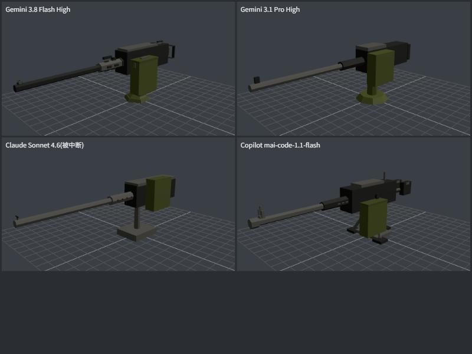

# 各家模型测试(2026-10-01)

> 任务 016。目的:给调度脚本选默认模型。两道小题,每个模型在干净的 worktree 里各做一遍,脚本评分加主程审查。
> 方法、权限和评分规则见 `scripts/agents/README.md`;原始报告在本机 `Archive/agent-runs/bench-run-202610010321/`,Opus 4.6 的 B2 补测在 `Archive/agent-runs/bench-opus-b2-run-202610011246/`。

## 0. 结论

| 用途 | 建议 |
|---|---|
| Antigravity 默认 | **Gemini 3.8 Flash High**:两题都满分,外观最好,从不碰被禁止的命令,用量适中 |
| Antigravity 第二选择 | **Claude Opus 4.6**(第三方额度,和 Gemini 分开计):两题都满分,代码最规整,外观和 3.8 Flash 相当,token 用量最省;适合需要另一种思路、或 Gemini 五小时限额用完时 |
| 不建议 | Gemini 3.1 Pro High(不比 3.8 Flash 强,还占五小时上限);Claude Sonnet 4.6(能力不如 3.8 Flash High,负责人也不打算用);GPT-OSS 120B(失控,见下) |
| Copilot(目前只有 mai-code-1.1-flash) | 适合边界清楚的小逻辑和补测试:B1 最快最短,而且正确;建模的空间感弱一些。10 月 3 日权益生效后重测更多模型 |

## 1. 题目

- **B1 纯逻辑**(`scripts/agents/bench/b1-penetration.md`):写一个纯函数,按项目的弹道模型算炮弹在各个距离上的速度、时间和穿深。隐藏测试共 10 个:和游戏里逐帧模拟的结果对照(五辆车的全部炮弹,误差小于 2%),外加距离 0、乱序输入、化学能弹、单调性、空数组。
- **B2 程序化建模**(`scripts/agents/bench/b2-m2hb.md`):用项目的建模工具做一挺 M2HB 重机枪零件。隐藏测试共 7 个,检查顶点色、三角面数、枪口和枪尾位置、底座高度、枪管轴线、机匣高度、弹箱在左侧。外观由主程截图对比。

## 2. 结果

机器分满分 80(隐藏测试 40、守规则 20、lint / test / build 20;测试题不要求填「结果」和写日志,这 10 分不计)。

| 模型 | B1 隐藏测试 | B1 用时 / 用量 | B2 隐藏测试 | B2 用时 / 用量 | 被拒后续跑 | 问题 |
|---|---|---|---|---|---|---|
| Gemini 3.8 Flash High | 10/10 | 3.3 分 / 20 万 + 4.4 万 token | **7/7** | 5.0 分 / 20 万 + 6.9 万 | 0 次 | 无 |
| Gemini 3.1 Pro High | 10/10 | 2.8 分 / 23 万 + 4.4 万 | 6/7 | 3.8 分 / 17 万 + 4.2 万 | 3 次 | B2 弹箱只偏左一点、模型太简单 |
| Claude Opus 4.6 | 10/10 | 7.3 分 / 26 万 + 1.8 万 | **7/7**(补测) | 8.1 分 / **12 万 + 2.5 万** | 2 + 1 次 | 注释用全角标点,和仓库习惯不一致;B2 把结果写进了题目卡(越界,别的模型没写) |
| Claude Sonnet 4.6 | 10/10 | 5.5 分 / 19 万 + 1.8 万 | 7/7(未完成) | 1.9 分后额度耗尽 | 4 次 | B1 多写了一条不要求的日志(越界);B2 中断,lint / build 没过 |
| GPT-OSS 120B | 10/10 | 10.1 分 / **500 万** + 5 万 | — | 额度耗尽,没跑 | 1 次 | 改了不许改的 `types.ts`;自己的测试有 2 个失败;一题烧掉 500 万 token |
| Copilot mai-code-1.1-flash | 10/10 | **1.6 分 / 1 次请求** | 5/7 | 4.2 分 / 1 次请求 | — | B2 枪管轴线低了 10 cm、弹箱不够偏左;`npm run lint / build` 被拒(放行规则写法问题,已改成 `shell(npm run:*)`,下次用 Copilot 时验证) |

「被拒后续跑」:agy 在无人值守时只要有一条命令被拒,这一轮就结束,脚本用同一会话续跑。次数越多,说明越不守「只用放行的命令」这条规则。

### B2 外观(左前上方看,地面格子 10 cm)

- **3.8 Flash High**:细节最全:带准星的长枪管、带孔的散热套筒、机匣、枪尾双握把、左侧弹箱、枪架。一眼能认出是 M2。
- **3.1 Pro High**:只有枪管、套筒、机匣、弹箱、圆底座,弹箱偏大,42 行代码。
- **Opus 4.6**(补测,不在上图里):准星、长枪管、带孔的散热套筒、机匣、枪尾握把、左侧弹箱、立柱枪架都有,一眼能认出是 M2,和 3.8 Flash 水平相当;弹箱偏高,侧面看挡住了一部分机匣。测试里自己发现枪尾超出 ±10% 并改短了握把。
- **Sonnet 4.6**:比例不错,但没做完(额度耗尽)。
- **mai-code**:组成部分齐全(准星、握把、三脚支架),但枪管比机匣中心低,看起来别扭。

### B1 代码

除 GPT-OSS 外,五家都用了同一个解析解 v = v₀·e^(−kx)、t = (e^(kx) − 1)/(k·v₀),复用了项目已有的 `dragK()` 和 `shellPenetration()`,注释是中文。差别主要在篇幅:mai-code 34 行最简洁;Sonnet 写了 74 行,其中一大半是推导注释。GPT-OSS 没想到解析解,自己写了逐帧积分,还在 `types.ts` 里重复声明了接口。

## 3. 额度观察

- Antigravity 的第三方模型(Claude、GPT-OSS)共用一份额度,和 Gemini 分开计。这次 GPT-OSS 一题就用掉约 500 万输入 token,连同两道 Claude 的题,把第三方额度耗尽了,约 5 小时后重置。Gemini 的额度没受影响。
- Copilot 每次调用记 1 次高级请求,不管做多久;这个账号目前只有 mai-code-1.1-flash 一个模型。

## 4. 测试本身的局限

- 每个模型每题只跑了一次,没有重复取平均。
- 题目偏小(S 级)。真正的建模任务(013–015)是 M 级,要看接口遵守和多文件协作,下一轮派发时再观察。
- 隐藏测试只能查「对不对」,查不了代码好不好维护;外观靠一张截图判断。

## 5. 后续

1. ~~第三方额度重置后,补测 Opus 4.6 的 B2~~:2026-10-01 已补测(作业 `scripts/agents/jobs/bench-2026-10-opus-b2.json`,分支 `bench/b2-opus46-r2`),结果见上表。
2. 10 月 3 日 Copilot 权益生效后,重测 Copilot 可用的模型;OpenAI 工单解决后,把 Codex CLI 加进调度脚本。
3. 下次测模型要换新题:这两道题的隐藏测试合并进 main 以后,agent 就能看到了。
